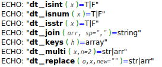
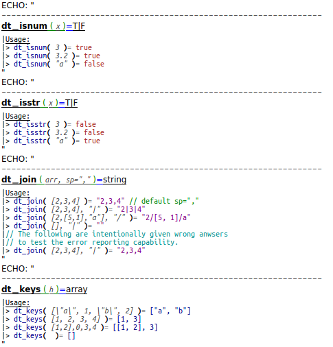
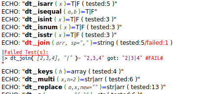
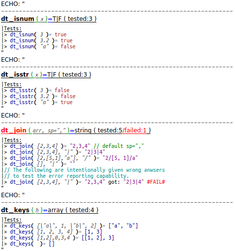
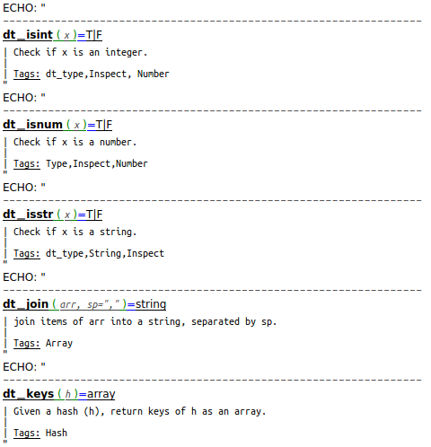
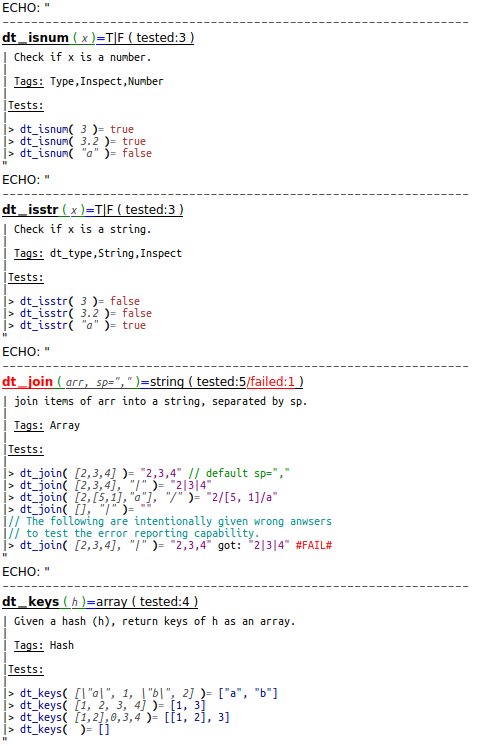

OpenSCAD_DocTest Modes
======================

[OpenSCAD_DocTest](https://github.com/runsun/openscad_doctest) is a library for *documentation* and *unit testing* of [OpenSCAD](http://www.openscad.org) functions. The mission is carried out by function `doctest(...["mode",mode])` that can be called with different `modes`. This file shows examples for output of all modes. 

####["mode",0]
No doc, doesn't do or display tests. Good for **directory listing**.  

####["mode",1]
No doc, doesn't do tests but display them. Good for **usage demo**.  

####["mode",2]
No doc, do tests, display only when fails. Good for **maintainance**.  

####["mode",3]
No doc, do and display tests. Good for **development/refactoring**.  

####["mode",10]
Show doc, doesn't do or display tests. Good for **documentation-only**.  

####["mode",11]
Show doc, doesn't do tests but display them. Good for **doc + usage demo**.  

####["mode",12]
Show doc, do tests, display only when fails.   

####["mode",13]
Show doc, do and display tests. Good for **development/refactoring**.  

