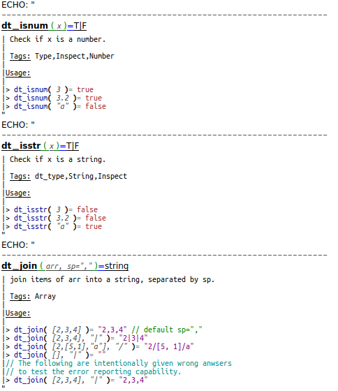
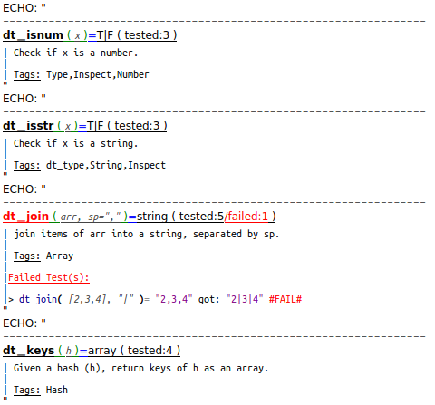

OpenSCAD_DocTest Modes
======================

Set `mode` when calling: `doctest(...["mode",mode])`

**["mode",0]** : No doc, doesn't do or display tests. Good for **directory listing**.  

 
**["mode",1]** : No doc, doesn't do tests but display them. Good for **usage demo**.  

 
**["mode",2]** : No doc, do tests, display only when fails. Good for **maintainance**.  

 
**["mode",3]** : No doc, do and display tests. Good for **development/refactoring**.  

 
**["mode",10]** : Show doc, doesn't do or display tests. Good for **documentation-only**.  

 
**["mode",11]** : Show doc, doesn't do tests but display them. Good for **doc + usage demo**.  

 
**["mode",12]** : Show doc, do tests, display only when fails.   

 
**["mode",13]** : Show doc, do and display tests. Good for **development/refactoring**.  

